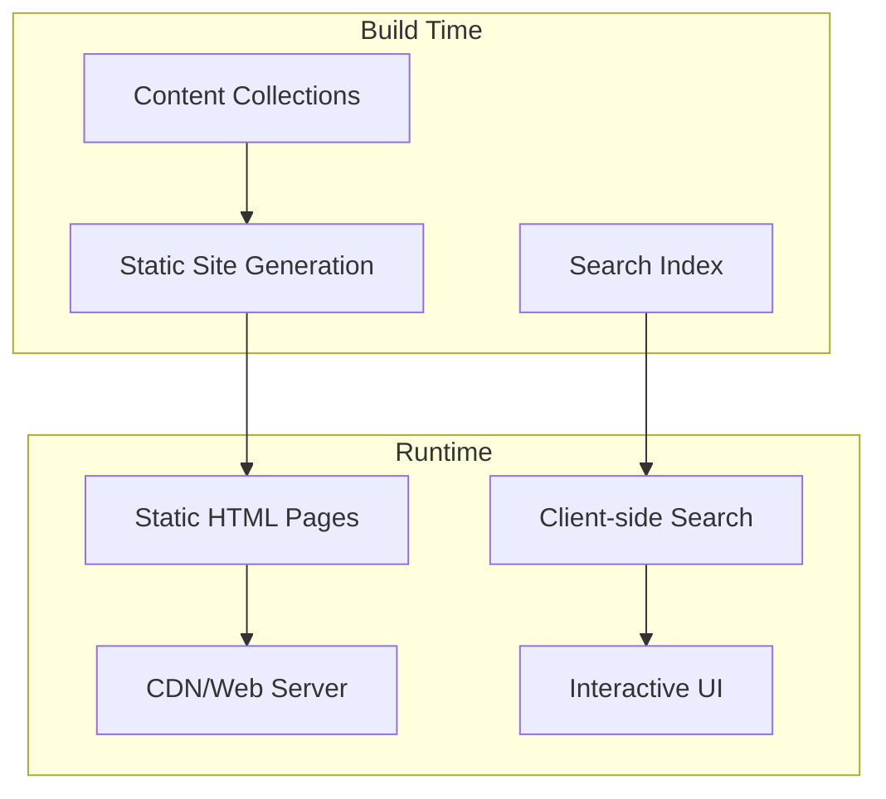

# Design Document

## Overview

TechGloss is a static site generator-based developer glossary built with Astro, leveraging Content Collections for type-safe content management and static generation for optimal performance. The architecture follows Astro's HTML-first philosophy, generating static pages for each glossary term while providing interactive search functionality through client-side JavaScript where needed.

## Architecture

### High-Level Architecture



### Directory Structure

```
src/
├── content/
│   ├── config.ts              # Content Collections configuration
│   └── glossary/              # Markdown files for each term
│       ├── api.md
│       ├── git.md
│       └── rest.md
├── pages/
│   ├── index.astro            # Homepage with term listing
│   ├── glossary/
│   │   └── [slug].astro       # Dynamic pages for each term
│   └── rss.xml.ts             # RSS feed generation
├── components/
│   ├── GlossaryCard.astro     # Term card component
│   ├── SearchBar.astro        # Search functionality
│   ├── RelatedLinks.astro     # Related terms component
│   ├── CodeBlock.astro        # Code syntax highlighting
│   └── ThemeToggle.astro      # Dark/light mode toggle
├── layouts/
│   ├── BaseLayout.astro       # Base HTML structure
│   └── GlossaryLayout.astro   # Layout for term pages
└── styles/
    └── starwind.css             # Global styles and themes
```

## Components and Interfaces

### Content Collection Schema

```typescript
// src/content/config.ts
import { defineCollection, z } from 'astro:content';

const glossary = defineCollection({
  schema: z.object({
    title: z.string(),
    slug: z.string(),
    category: z.string(),
    description: z.string(),
    related: z.array(z.string()).optional(),
    tags: z.array(z.string()).optional(),
    lastUpdated: z.date().optional(),
  }),
});

export const collections = {
  glossary,
};
```

### Core Components

#### GlossaryCard Component
- **Purpose**: Display term summary on homepage
- **Props**: `{ title: string, slug: string, category: string, description: string }`
- **Features**: Category badge, hover effects, responsive design

#### SearchBar Component
- **Purpose**: Real-time search functionality
- **Implementation**: Client-side with `client:load` directive
- **Search Strategy**: Fuse.js for fuzzy search with term titles, descriptions, and content
- **Features**: Debounced input, keyboard navigation, search highlighting

#### RelatedLinks Component
- **Purpose**: Display related terms on term pages
- **Props**: `{ related: string[], allTerms: CollectionEntry<'glossary'>[] }`
- **Features**: Automatic link generation, category grouping

#### CodeBlock Component
- **Purpose**: Syntax-highlighted code examples with copy functionality
- **Implementation**: Prism.js or Shiki for syntax highlighting
- **Features**: Copy-to-clipboard button, language detection, line numbers

### Page Components

#### Homepage (index.astro)
- **Data Source**: `getCollection('glossary')`
- **Features**: 
  - Grid layout of glossary cards
  - Category filtering
  - Search bar integration
  - Responsive design

#### Term Pages ([slug].astro)
- **Data Source**: `getEntryBySlug('glossary', slug)`
- **Features**:
  - Full term content rendering
  - Related terms section
  - Navigation breadcrumbs
  - Social sharing meta tags

## Data Models

### Glossary Term Structure

```markdown
---
title: "API"
slug: "api"
category: "Web"
description: "Application Programming Interface - a set of protocols and tools for building software applications"
related: ["rest", "endpoint", "json"]
tags: ["web", "backend", "integration"]
lastUpdated: 2024-01-15
---

# API (Application Programming Interface)

API คือกลไกที่ระบบสามารถสื่อสารกันได้...

## ตัวอย่างการใช้งาน

```javascript
fetch('/api/users')
  .then(response => response.json())
  .then(data => console.log(data));
```

## แนวคิดที่เกี่ยวข้อง

- REST API
- GraphQL
- WebSocket
```

### Search Index Structure

```typescript
interface SearchIndex {
  id: string;
  title: string;
  slug: string;
  category: string;
  description: string;
  content: string;
  tags: string[];
}
```

## Error Handling

### Build-Time Error Handling
- **Content Validation**: Zod schema validation for all glossary entries
- **Broken Links**: Validation of related term references during build
- **Missing Assets**: Check for referenced images and code files

### Runtime Error Handling
- **404 Pages**: Custom 404 page for missing terms
- **Search Errors**: Graceful degradation if search index fails to load
- **Theme Persistence**: Fallback to system preference if localStorage fails

### Error Recovery Strategies
- **Partial Content**: Display available content even if some related terms are missing
- **Search Fallback**: Basic string matching if Fuse.js fails to initialize
- **Progressive Enhancement**: Core functionality works without JavaScript

## Testing Strategy

### Unit Testing
- **Component Testing**: Test individual Astro components with @astro/test
- **Content Validation**: Test content collection schema validation
- **Search Logic**: Test search functionality with various query types
- **Utility Functions**: Test helper functions for content processing

### Integration Testing
- **Page Generation**: Test that all glossary terms generate valid pages
- **Search Integration**: Test search functionality across different browsers
- **RSS Feed**: Validate RSS feed generation and content
- **Theme Switching**: Test dark/light mode persistence and switching

### Performance Testing
- **Build Performance**: Monitor build times as content grows
- **Search Performance**: Test search response times with large datasets
- **Page Load Speed**: Lighthouse audits for Core Web Vitals
- **Bundle Size**: Monitor JavaScript bundle size for client-side features

### SEO Testing
- **Meta Tags**: Validate meta tags for each generated page
- **Structured Data**: Test schema.org markup for glossary terms
- **Sitemap Generation**: Validate sitemap.xml completeness
- **Social Media**: Test Open Graph and Twitter Card previews

## Performance Considerations

### Build Optimization
- **Static Generation**: All pages pre-generated at build time
- **Image Optimization**: Astro's built-in image optimization for any term images
- **CSS Optimization**: Scoped styles and CSS purging
- **Bundle Splitting**: Separate bundles for search functionality

### Runtime Optimization
- **Lazy Loading**: Search index loaded only when search is activated
- **Service Worker**: Cache static assets and search index
- **Prefetching**: Prefetch related terms on hover
- **Theme Persistence**: Store theme preference in localStorage

### Scalability
- **Content Growth**: Architecture supports thousands of terms
- **Search Scaling**: Fuse.js handles large datasets efficiently
- **CDN Ready**: Static files optimized for CDN distribution
- **Incremental Builds**: Only rebuild changed content during development