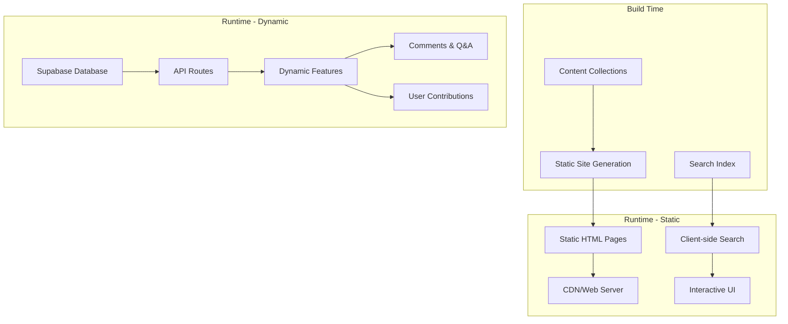

# เอกสารการออกแบบ

## ภาพรวม

TechGloss เป็นพจนานุกรมสำหรับนักพัฒนาที่ใช้แนวทาง hybrid ซึ่งรวมการสร้างเว็บไซต์แบบสถิตกับฟีเจอร์แบบโต้ตอบ สร้างด้วย Astro เพื่อประสิทธิภาพและ SEO ที่เหมาะสม ใช้ Supabase สำหรับเนื้อหาที่สร้างโดยผู้ใช้ รวมถึงความคิดเห็น คำถาม-คำตอบ และการมีส่วนร่วมของชุมชน สถาปัตยกรรมรักษาประโยชน์ของการสร้างแบบสถิตในขณะที่เพิ่มฟีเจอร์ชุมชนแบบไดนามิก

## สถาปัตยกรรม

### สถาปัตยกรรมระดับสูง



### โครงสร้างไดเรกทอรี

```
src/
├── content/
│   ├── config.ts              # การกำหนดค่า Content Collections
│   └── glossary/              # ไฟล์ Markdown สำหรับแต่ละศัพท์
│       ├── api.md
│       ├── git.md
│       └── rest.md
├── pages/
│   ├── index.astro            # หน้าแรกพร้อมรายการศัพท์
│   ├── glossary/
│   │   └── [slug].astro       # หน้าไดนามิกสำหรับแต่ละศัพท์
│   ├── api/
│   │   ├── comments.ts        # API ความคิดเห็น
│   │   ├── questions.ts       # API คำถาม-คำตอบ
│   │   ├── contributions.ts   # API การมีส่วนร่วมของผู้ใช้
│   │   └── auth.ts           # API การยืนยันตัวตน
│   └── rss.xml.ts             # การสร้าง RSS feed
├── components/
│   ├── GlossaryCard.astro     # คอมโพเนนต์การ์ดศัพท์
│   ├── SearchBar.astro        # ฟังก์ชันการค้นหา
│   ├── RelatedLinks.astro     # คอมโพเนนต์ศัพท์ที่เกี่ยวข้อง
│   ├── CodeBlock.astro        # การไฮไลท์ไวยากรณ์โค้ด
│   ├── ThemeToggle.astro      # การสลับธีมสว่าง/มืด
│   ├── Comments.astro         # ส่วนความคิดเห็น
│   ├── CommentForm.astro      # ฟอร์มส่งความคิดเห็น
│   ├── QASection.astro        # ส่วนคำถาม-คำตอบ
│   ├── QuestionForm.astro     # ฟอร์มส่งคำถาม
│   ├── ContributionForm.astro # ฟอร์มส่งศัพท์ใหม่
│   └── AuthButton.astro       # คอมโพเนนต์การยืนยันตัวตน
├── layouts/
│   ├── BaseLayout.astro       # โครงสร้าง HTML พื้นฐาน
│   └── GlossaryLayout.astro   # เลย์เอาต์สำหรับหน้าศัพท์
├── lib/
│   ├── supabase.ts           # การกำหนดค่า Supabase client
│   ├── auth.ts               # ยูทิลิตี้การยืนยันตัวตน
│   └── database.ts           # ยูทิลิตี้ฐานข้อมูล
└── styles/
    └── starwind.css             # สไตล์ทั่วโลกและธีม
```

## โครงสร้างฐานข้อมูล (Supabase)

### โครงสร้างตาราง

```sql
-- ตารางผู้ใช้ (ขยายจาก auth.users ของ Supabase)
CREATE TABLE public.profiles (
  id UUID REFERENCES auth.users(id) PRIMARY KEY,
  username TEXT UNIQUE,
  avatar_url TEXT,
  created_at TIMESTAMP WITH TIME ZONE DEFAULT NOW(),
  updated_at TIMESTAMP WITH TIME ZONE DEFAULT NOW()
);

-- ตารางความคิดเห็น
CREATE TABLE public.comments (
  id UUID DEFAULT gen_random_uuid() PRIMARY KEY,
  term_slug TEXT NOT NULL,
  user_id UUID REFERENCES auth.users(id),
  content TEXT NOT NULL,
  parent_id UUID REFERENCES public.comments(id),
  created_at TIMESTAMP WITH TIME ZONE DEFAULT NOW(),
  updated_at TIMESTAMP WITH TIME ZONE DEFAULT NOW()
);

-- ตารางคำถาม
CREATE TABLE public.questions (
  id UUID DEFAULT gen_random_uuid() PRIMARY KEY,
  title TEXT NOT NULL,
  content TEXT NOT NULL,
  user_id UUID REFERENCES auth.users(id),
  term_slug TEXT,
  tags TEXT[],
  is_resolved BOOLEAN DEFAULT FALSE,
  created_at TIMESTAMP WITH TIME ZONE DEFAULT NOW(),
  updated_at TIMESTAMP WITH TIME ZONE DEFAULT NOW()
);

-- ตารางคำตอบ
CREATE TABLE public.answers (
  id UUID DEFAULT gen_random_uuid() PRIMARY KEY,
  question_id UUID REFERENCES public.questions(id) ON DELETE CASCADE,
  user_id UUID REFERENCES auth.users(id),
  content TEXT NOT NULL,
  is_accepted BOOLEAN DEFAULT FALSE,
  created_at TIMESTAMP WITH TIME ZONE DEFAULT NOW(),
  updated_at TIMESTAMP WITH TIME ZONE DEFAULT NOW()
);

-- ตารางการมีส่วนร่วมของผู้ใช้
CREATE TABLE public.contributions (
  id UUID DEFAULT gen_random_uuid() PRIMARY KEY,
  title TEXT NOT NULL,
  slug TEXT NOT NULL,
  category TEXT NOT NULL,
  description TEXT NOT NULL,
  content TEXT NOT NULL,
  user_id UUID REFERENCES auth.users(id),
  status TEXT DEFAULT 'pending', -- pending, approved, rejected
  reviewed_by UUID REFERENCES auth.users(id),
  reviewed_at TIMESTAMP WITH TIME ZONE,
  created_at TIMESTAMP WITH TIME ZONE DEFAULT NOW(),
  updated_at TIMESTAMP WITH TIME ZONE DEFAULT NOW()
);

-- ตารางการโหวต (สำหรับความคิดเห็นและคำตอบ)
CREATE TABLE public.votes (
  id UUID DEFAULT gen_random_uuid() PRIMARY KEY,
  user_id UUID REFERENCES auth.users(id),
  target_type TEXT NOT NULL, -- 'comment', 'answer'
  target_id UUID NOT NULL,
  vote_type TEXT NOT NULL, -- 'up', 'down'
  created_at TIMESTAMP WITH TIME ZONE DEFAULT NOW(),
  UNIQUE(user_id, target_type, target_id)
);
```

### นโยบายความปลอดภัยระดับแถว (RLS)

```sql
-- เปิดใช้งาน RLS บนตารางทั้งหมด
ALTER TABLE public.profiles ENABLE ROW LEVEL SECURITY;
ALTER TABLE public.comments ENABLE ROW LEVEL SECURITY;
ALTER TABLE public.questions ENABLE ROW LEVEL SECURITY;
ALTER TABLE public.answers ENABLE ROW LEVEL SECURITY;
ALTER TABLE public.contributions ENABLE ROW LEVEL SECURITY;
ALTER TABLE public.votes ENABLE ROW LEVEL SECURITY;

-- นโยบายโปรไฟล์
CREATE POLICY "Public profiles are viewable by everyone" ON public.profiles
  FOR SELECT USING (true);

CREATE POLICY "Users can update own profile" ON public.profiles
  FOR UPDATE USING (auth.uid() = id);

-- นโยบายความคิดเห็น
CREATE POLICY "Comments are viewable by everyone" ON public.comments
  FOR SELECT USING (true);

CREATE POLICY "Authenticated users can insert comments" ON public.comments
  FOR INSERT WITH CHECK (auth.role() = 'authenticated');

CREATE POLICY "Users can update own comments" ON public.comments
  FOR UPDATE USING (auth.uid() = user_id);

CREATE POLICY "Users can delete own comments" ON public.comments
  FOR DELETE USING (auth.uid() = user_id);

-- นโยบายคล้ายกันสำหรับตารางอื่นๆ...
```

## คอมโพเนนต์และอินเทอร์เฟซ

### สคีมาคอลเลกชันเนื้อหา (อัปเดต)

```typescript
// src/content/config.ts
import { defineCollection, z } from 'astro:content';

const glossary = defineCollection({
  schema: z.object({
    title: z.string(),
    slug: z.string(),
    category: z.string(),
    description: z.string(),
    related: z.array(z.string()).optional(),
    tags: z.array(z.string()).optional(),
    lastUpdated: z.date().optional(),
    hasComments: z.boolean().default(true), // เปิด/ปิดความคิดเห็น
    hasQASection: z.boolean().default(true), // เปิด/ปิดคำถาม-คำตอบ
  }),
});

export const collections = {
  glossary,
};
```

### คอมโพเนนต์แบบโต้ตอบใหม่

#### คอมโพเนนต์ความคิดเห็น
- **วัตถุประสงค์**: แสดงและจัดการความคิดเห็นสำหรับแต่ละศัพท์
- **ฟีเจอร์**: 
  - ความคิดเห็นแบบ threaded พร้อมการตอบกลับ
  - ระบบการโหวตขึ้น/ลง
  - อัปเดตแบบเรียลไทม์ด้วย Supabase subscriptions
  - รองรับ Markdown สำหรับความคิดเห็น
  - รูปโปรไฟล์ผู้ใช้และเวลาที่โพสต์

#### คอมโพเนนต์คำถาม-คำตอบ
- **วัตถุประสงค์**: คำถามและคำตอบที่เกี่ยวข้องกับศัพท์
- **ฟีเจอร์**:
  - ถามคำถามเกี่ยวกับศัพท์เฉพาะ
  - แท็กคำถามด้วยศัพท์ที่เกี่ยวข้อง
  - ยอมรับคำตอบที่ดีที่สุด
  - ค้นหาและกรองคำถาม
  - ระบบแจ้งเตือนสำหรับคำตอบ

#### คอมโพเนนต์ฟอร์มการมีส่วนร่วม
- **วัตถุประสงค์**: อนุญาตให้ผู้ใช้ส่งศัพท์ใหม่
- **ฟีเจอร์**:
  - การตรวจสอบฟอร์มด้วย Zod
  - ฟังก์ชันตัวอย่าง
  - Markdown editor
  - การเลือกหมวดหมู่และแท็ก
  - การติดตามสถานะการส่ง

#### คอมโพเนนต์ปุ่มยืนยันตัวตน
- **วัตถุประสงค์**: จัดการการยืนยันตัวตนของผู้ใช้
- **ฟีเจอร์**:
  - การรวม OAuth กับ GitHub
  - การจัดการโปรไฟล์ผู้ใช้
  - ฟังก์ชันเข้าสู่ระบบ/ออกจากระบบ
  - แสดงรูปโปรไฟล์ผู้ใช้

### เส้นทาง API

#### API ความคิดเห็น (`/api/comments`)
```typescript
// GET /api/comments?term_slug=api
// POST /api/comments
// PUT /api/comments/:id
// DELETE /api/comments/:id
```

#### API คำถาม-คำตอบ (`/api/questions`)
```typescript
// GET /api/questions?term_slug=api
// POST /api/questions
// PUT /api/questions/:id
// DELETE /api/questions/:id
```

#### API การมีส่วนร่วม (`/api/contributions`)
```typescript
// GET /api/contributions?status=pending
// POST /api/contributions
// PUT /api/contributions/:id
// DELETE /api/contributions/:id
```

## กลยุทธ์การยืนยันตัวตน

### การรวม OAuth กับ GitHub
- **ผู้ให้บริการ**: Supabase Auth กับ GitHub
- **ประโยชน์**: 
  - ไม่ต้องจัดการรหัสผ่าน
  - ตัวตนที่เชื่อถือได้
  - การรวมที่ง่าย
  - เป็นมิตรกับฟรีเทียร์

### บทบาทผู้ใช้
- **ไม่ระบุตัวตน**: สามารถดูเนื้อหาและความคิดเห็น
- **ยืนยันตัวตนแล้ว**: สามารถแสดงความคิดเห็น ถามคำถาม ส่งการมีส่วนร่วม
- **ผู้ดูแล**: สามารถดูแลความคิดเห็นและอนุมัติการมีส่วนร่วม
- **ผู้ดูแลระบบ**: เข้าถึงฟีเจอร์ทั้งหมด

## กลยุทธ์การปรับใช้ (Vercel)

### การพิจารณาฟรีเทียร์
- **Supabase ฟรีเทียร์**: 
  - ฐานข้อมูล 500MB
  - ผู้ใช้ที่ใช้งานจริง 50,000 คนต่อเดือน
  - แบนด์วิธ 2GB
  - การสมัครสมาชิกแบบเรียลไทม์
- **Vercel ฟรีเทียร์**:
  - แบนด์วิธ 100GB
  - การทำงานของฟังก์ชันเซิร์ฟเวอร์เลส 100 ครั้งต่อวัน
  - การปรับใช้อัตโนมัติ

### การปรับแต่งสำหรับฟรีเทียร์
- **การสร้างแบบสถิต**: เพิ่มเนื้อหาแบบสถิตเพื่อลดการเรียกฟังก์ชันเซิร์ฟเวอร์เลส
- **การแคช**: ใช้การแคชอย่างแข็งขันสำหรับการตอบสนอง API
- **การจำกัดอัตรา**: ป้องกันการละเมิดขีดจำกัดฟรีเทียร์
- **การติดตาม**: ติดตามการใช้งานเพื่ออยู่ในขีดจำกัด

## โมเดลข้อมูล

### โครงสร้างเนื้อหาแบบโต้ตอบ

```typescript
interface Comment {
  id: string;
  term_slug: string;
  user_id: string;
  content: string;
  parent_id?: string;
  created_at: string;
  updated_at: string;
  user: {
    username: string;
    avatar_url?: string;
  };
  votes: {
    up: number;
    down: number;
  };
}

interface Question {
  id: string;
  title: string;
  content: string;
  user_id: string;
  term_slug?: string;
  tags: string[];
  is_resolved: boolean;
  created_at: string;
  answers: Answer[];
  user: {
    username: string;
    avatar_url?: string;
  };
}

interface Contribution {
  id: string;
  title: string;
  slug: string;
  category: string;
  description: string;
  content: string;
  user_id: string;
  status: 'pending' | 'approved' | 'rejected';
  created_at: string;
  user: {
    username: string;
    avatar_url?: string;
  };
}
```

## การจัดการข้อผิดพลาด

### การจัดการข้อผิดพลาดฐานข้อมูล
- **ปัญหาการเชื่อมต่อ**: ถอยกลับไปยังเนื้อหาแบบสถิตอย่างสง่างาม
- **การละเมิด RLS**: ข้อความแสดงข้อผิดพลาดที่ชัดเจนสำหรับผู้ใช้
- **การจำกัดอัตรา**: ข้อความจำกัดอัตราที่เป็นมิตรกับผู้ใช้
- **ข้อผิดพลาดการยืนยันตัวตน**: เปลี่ยนเส้นทางไปยังการเข้าสู่ระบบพร้อมข้อความที่ชัดเจน

### การจัดการข้อผิดพลาด API
- **ข้อผิดพลาดการตรวจสอบ**: ข้อเสนอแนะการตรวจสอบฟอร์มรายละเอียด
- **ข้อผิดพลาดเครือข่าย**: กลไกการลองใหม่ด้วยการถอยหลังแบบเอกซ์โพเนนเชียล
- **ข้อผิดพลาดเซิร์ฟเวอร์**: ถอยกลับไปยังเนื้อหาแบบสถิตเมื่อเป็นไปได้

## กลยุทธ์การทดสอบ

### การทดสอบฐานข้อมูล
- **การทดสอบการรวม**: ทดสอบเส้นทาง API กับ Supabase
- **การทดสอบ RLS**: ตรวจสอบว่านโยบายความปลอดภัยทำงานถูกต้อง
- **การทดสอบประสิทธิภาพ**: ติดตามประสิทธิภาพการสอบถาม
- **การทดสอบโหลด**: ทดสอบกับสถานการณ์ผู้ใช้ที่เป็นจริง

### การทดสอบการยืนยันตัวตน
- **การไหลของ OAuth**: ทดสอบการยืนยันตัวตน GitHub
- **การเข้าถึงตามบทบาท**: ทดสอบสิทธิ์ผู้ใช้ที่แตกต่างกัน
- **การจัดการเซสชัน**: ทดสอบการไหลเข้าสู่ระบบ/ออกจากระบบ

## การพิจารณาประสิทธิภาพ

### การปรับแต่งแบบ Hybrid
- **สถิตก่อน**: สร้างหน้าแบบสถิตสำหรับศัพท์ในพจนานุกรมทั้งหมด
- **การโหลดแบบไดนามิก**: โหลดฟีเจอร์แบบโต้ตอบตามความต้องการ
- **กลยุทธ์การแคช**: แคชการตอบสนอง API อย่างแข็งขัน
- **การปรับแต่ง CDN**: ใช้เครือข่าย edge ของ Vercel

### การปรับแต่งฐานข้อมูล
- **การสร้างดัชนี**: ดัชนีที่เหมาะสมบนคอลัมน์ที่สอบถามบ่อย
- **การรวมการเชื่อมต่อ**: การเชื่อมต่อฐานข้อมูลที่มีประสิทธิภาพ
- **การปรับแต่งการสอบถาม**: ลดการเรียกฐานข้อมูล
- **ประสิทธิภาพแบบเรียลไทม์**: ใช้การสมัครสมาชิก Supabase อย่างรอบคอบ

### การปรับแต่งต้นทุน
- **การติดตามฟรีเทียร์**: ติดตามการใช้งานเพื่ออยู่ในขีดจำกัด
- **การสอบถามที่มีประสิทธิภาพ**: ลดการทำงานฐานข้อมูล
- **การสร้างแบบสถิต**: ลดการเรียกฟังก์ชันเซิร์ฟเวอร์เลส
- **การแคช**: ลดการเรียก API ที่ซ้ำซ้อน

## กลยุทธ์การย้ายข้อมูล

### ระยะที่ 1: พื้นฐาน
1. ตั้งค่าโปรเจค Supabase
2. ใช้การยืนยันตัวตน
3. สร้างสคีมาฐานข้อมูล
4. ปรับใช้บน Vercel

### ระยะที่ 2: ฟีเจอร์หลัก
1. ใช้ระบบความคิดเห็น
2. เพิ่มฟังก์ชันคำถาม-คำตอบ
3. สร้างระบบการมีส่วนร่วม
4. เพิ่มเครื่องมือการดูแล

### ระยะที่ 3: การปรับปรุง
1. ฟีเจอร์แบบเรียลไทม์
2. การค้นหาขั้นสูง
3. โปรไฟล์ผู้ใช้
4. การวิเคราะห์และการติดตาม

## การติดตามและการวิเคราะห์

### การติดตามฟรีเทียร์
- **การใช้งาน Supabase**: ติดตามการใช้งานฐานข้อมูลและแบนด์วิธ
- **การใช้งาน Vercel**: ติดตามการทำงานของฟังก์ชันและแบนด์วิธ
- **การติดตามข้อผิดพลาด**: ใช้การติดตามข้อผิดพลาด
- **การติดตามประสิทธิภาพ**: ติดตาม Core Web Vitals

### การวิเคราะห์ผู้ใช้
- **กิจกรรมความคิดเห็น**: ติดตามการมีส่วนร่วมกับความคิดเห็น
- **กิจกรรมคำถาม-คำตอบ**: ติดตามรูปแบบคำถามและคำตอบ
- **คุณภาพการมีส่วนร่วม**: ติดตามอัตราการอนุมัติการมีส่วนร่วม
- **การเติบโตของผู้ใช้**: ติดตามการลงทะเบียนและรักษาผู้ใช้